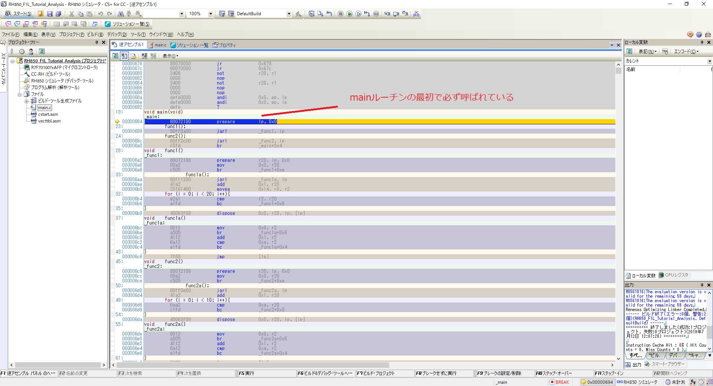

# RH850について
ルネサスエレクトロニクス株式会社が作ったCPU及びアーキテクチャの総評

# 開発環境
RH850は以下の統合開発環境で動作する。
* CS+ for CC
* ６０日間の無償版あり

[https://www.renesas.com/jp/ja/products/software-tools/tools/ide/csplus.html](https://www.renesas.com/jp/ja/products/software-tools/tools/ide/csplus.html)

また、ルネサス系の統合開発環境とアーキテクチャの関係性は以下を参照するとわかる。

[https://www.renesas.com/jp/ja/products/software-tools/tools/migration-tools/migrating-between-ides.html](https://www.renesas.com/jp/ja/products/software-tools/tools/migration-tools/migrating-between-ides.html)

以下の画像は上記より重要事項を抜粋したもの。CS+ for CCさえあれば、ルネサス系のアーキテクチャは対応できそう。

# RH850命令セット
CS+ for CCのドキュメントに記載されている。

[http://tool-support.renesas.com/autoupdate/support/onlinehelp/ja-JP/csp/V4.01.00/CS+.chm/Compiler-CCRH.chm/Output/ccrh05c0000y.html](http://tool-support.renesas.com/autoupdate/support/onlinehelp/ja-JP/csp/V4.01.00/CS+.chm/Compiler-CCRH.chm/Output/ccrh05c0000y.html)

# CS+ for CCによる実行ファイルの作成(一例)
1. CS+ for CCを起動
  * My Renesasへのログインとか言うのは消してよい。

2. 1 サンプルプロジェクトを読み込むの下の**RH850_F1L_Tutorial_Analysis**をクリックしてGOと書いてあるボタンをクリックする
  * 今回はDesktopに作成した。

3. ビルド→ビルドプロジェクトをクリック

4. "RH850_F1L_Tutorial_Analysis/DefaultBuild"に"RH850_F1L_Tutorial_Analysis.mot"が作成されていれば、終了。

# motファイルとは
モトローラ・Sタイプ・ファイルの略。
バイナリファイルを16進数の文字列としてテクストファイルにしたものらしい。
下記URLに詳細な説明がある。

[http://tool-support.renesas.com/autoupdate/support/onlinehelp/ja-JP/csp/V6.01.00/CS+.chm/Compiler-CCRL.chm/Output/bd_output42.html](http://tool-support.renesas.com/autoupdate/support/onlinehelp/ja-JP/csp/V6.01.00/CS+.chm/Compiler-CCRL.chm/Output/bd_output42.html)

# ディスアセンブル
* 環境　：　ida pro（いつからサポートしているかは知らない）
* GhidraでRH850はディスアセンブルできないらしい

1. 先ほど作ったmotファイルをidaで開く
  * RH850を選択
  * idaはモトローラも自動で変換して呼んでくれるみたいなので、わざわざ、motをbinに変換する必要はない

2. CS+ for CCを起動し、今読み込んでいるファイルのプロジェクトを開き、デバックする。
  * 逆アセンブル1を見る

3. CS+でデバックしているときのmainアドレスの位置を確認する
  * 今回の場合は00000694

4. CS+で確認したmainアドレス値をidaで確認する。
  * この時点ではmainは無いはず
  * うまくデコンパイルできていない
  * データセグメントと混ざっている？

5. idaでmainアドレス値から適当な範囲をundifineする

6. idaでopecodeを見れるように設定する(他も色々設定)

7. idaで80072100とopecodeがなっていそうな場所をさがす。
  * 80072100はprepareという命令が関数の始まりに必ず実行される
  * RH850はデータセグメントの次に必ずmainルーチンがくる
  * つまり、データセグメントとルーチンの境界線、そしてprepareのオペコードからmainが特定できる

8. idaで80072100のオペコードから点線が引かれているところまで再度デコンパイルする
  * 右クリック→code
  * codeボタンを押したらanalyzeかforceかcloseかみたなダイアログがでる。analyzeで良い
  * idaはcodeボタンを押すと、jumpやreturn等の関数が終了するところを自動で判断してルーチンを作成する

9. 他にundefineしたところ、ディスアセンブルする

# ディスアセンブリに現れる大量のNOPについて
motファイルは一番初めに大量のNOPが挿入されるらしい。
CS+ for CCでデバックしているときも同じ現象だったのでバグではなく仕様であると考えられる

# アドレス空間の確認

Excelでアドレス空間を確認できるツールがある(mot対応)。これがあれば、データセグメントとルーチンの分け目が分かるためディスアセンブルの助けになる。
* HexAreaChecker 

[http://toowaki.web.fc2.com/#HexAreaChecker](http://toowaki.web.fc2.com/#HexAreaChecker)

[pdf：http://toowaki.web.fc2.com/Readme_HexAreaChecker_JP.pdf](http://toowaki.web.fc2.com/Readme_HexAreaChecker_JP.pdf)
